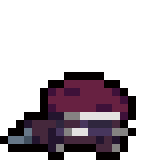

<h3 align="center">ᓚᘏᗢ Hii, I'm Kel!! let's Work Together?! (～￣▽￣)～</h3>

###

<h4 align="left">Techs:</h4>

###

  
  
  
  
  

###

 

<h4 align="left">About Me:</h4>

###

» Game Dev and aspiring Game Designer » Looking for my first job  ( you can be the first   []~(￣▽￣)~*  )

<b>»Contact me:<b> montekel@gmail.com
 

  
Check more about me :)

  
  ### My Personal Information
  
  » I'm 20 Years Old  
  » I have 2 cats, "Nicholas" and "Aurora" they're 3 years old and i love them :)  
  » I've always played all kinds of games, but I've always been fascinated by indie games, and this passion for playing made me want to create my own games, that's when I ended up discovering the world of programming and that's why I got into computer science and aspiring to a profession as a game developer.  
  » I'm fascinated by souls-like games and my biggest dream would be to one day be able to work where my favorite game franchise originated (Dark Souls), but besides inspiration from souls-like games I'm also very inspired by games like Celeste and Hollow Knight.  
  » I currently live in Brazil but I've always wanted to visit and who knows, maybe one day I'll be able to live in Japan.  
  

###

  

###

  
  
  

###

<h4 align="center">Lucky Chopper:</h4>

  

###
